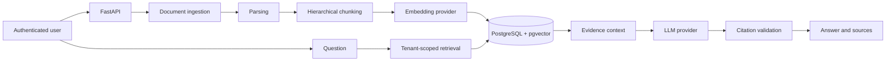

# Ihsan RAG AI

I built this project to understand what a RAG system needs beyond a notebook demo.

It is currently a backend-only FastAPI application for private document question answering. A signed-in user can upload documents, process them into structured chunks, store embeddings in PostgreSQL, search only their own data, and request an answer with validated source references.

The frontend is not part of the repository yet. My current focus is the backend pipeline and the boundaries between document processing, retrieval, generation, and validation.

## Current status

| Area | State |
|---|---|
| Authentication and user isolation | Implemented |
| Document ingestion and parsing | Implemented |
| Hierarchical chunking | Implemented |
| Embedding storage and vector retrieval | Implemented |
| Grounded answer generation | Implemented |
| Citation reference validation | Implemented |
| Dockerized local runtime | Implemented |
| GitHub Actions CI | Implemented |
| Frontend | Not started |
| Cloud deployment | Not started |
| Latest test checkpoint | 87 passed |

The automated suite runs with deterministic embedding and LLM providers, both locally and in GitHub Actions.

## What works

- JWT-based registration, login, and protected routes
- Per-user document ownership and retrieval isolation
- Upload and processing for PDF, DOCX, PPTX, XLSX, TXT, Markdown, and CSV
- Structured parsing into pages, slides, sheets, sections, or text units
- Deterministic hierarchical chunking with parent and child relationships
- Deterministic embeddings for tests and OpenAI embeddings for semantic search
- PostgreSQL vector storage with pgvector
- HNSW cosine-similarity search with document, role, and score filters
- Safe embedding rebuild without parsing the document again
- Evidence deduplication and context budgeting before generation
- Deterministic and OpenAI LLM providers behind a shared interface
- Grounded answer generation with `[S1]`, `[S2]` style source references
- Validation for missing, malformed, unknown, and uncited references
- Refusal when retrieval returns no usable evidence

## Request flow



The user ID comes from the JWT token. It is not accepted as a search or answer field. Document IDs can narrow a query, but they do not bypass ownership checks.

## Main design choices

### PostgreSQL is also the vector store

The project uses pgvector instead of adding a second database. Users, documents, chunks, metadata, and embeddings stay in PostgreSQL, which keeps ownership filtering and transaction handling in one place.

Embeddings are stored in a `VECTOR(384)` column and searched with cosine distance through an HNSW index.

### Retrieval is separate from answer generation

The retrieval endpoint can be called without an LLM. This makes it possible to inspect ranked chunks and debug the search stage before checking the final answer.

The answer endpoint reuses the same retrieval service and adds:

1. duplicate and redundant evidence removal;
2. global and per-source context limits;
3. stable source IDs;
4. LLM generation;
5. citation validation.

### Tests do not require external APIs

The automated suite uses deterministic embedding and LLM providers. This keeps tests reproducible and avoids network calls or API charges. OpenAI providers can be enabled through environment settings for real semantic embeddings and generation.

### Re-embedding reuses stored chunks

Changing an embedding configuration should not require parsing and chunking the source file again. The rebuild endpoint loads the existing chunks and replaces only the matching provider/model records inside a transaction.

## Technology

| Area | Technology |
|---|---|
| API | FastAPI |
| Validation and settings | Pydantic, pydantic-settings |
| Database access | SQLAlchemy |
| Database | PostgreSQL |
| Vector search | pgvector, HNSW, cosine distance |
| Migrations | Alembic |
| Authentication | JWT, bcrypt |
| Document parsing | pypdf, python-docx, python-pptx, openpyxl |
| LLM and embeddings | OpenAI SDK, deterministic test providers |
| Local infrastructure | Docker Compose |
| Tests and CI | pytest, FastAPI TestClient, GitHub Actions |

## Repository structure

The tree below shows the repository at a folder level. Generated folders such as `.venv`, `__pycache__`, test caches, and local uploads are intentionally left out.

```text
ihsan-rag-ai/
├── backend/
│   ├── alembic/
│   │   └── versions/
│   ├── app/
│   │   ├── api/
│   │   │   └── v1/
│   │   ├── auth/
│   │   ├── config/
│   │   ├── core/
│   │   ├── database/
│   │   ├── embeddings/
│   │   ├── llms/
│   │   ├── middleware/
│   │   ├── models/
│   │   ├── parsers/
│   │   ├── rag/
│   │   ├── retrieval/
│   │   ├── schemas/
│   │   ├── services/
│   │   └── main.py
│   ├── tests/
│   ├── .dockerignore
│   ├── .env.example
│   ├── alembic.ini
│   ├── docker-entrypoint.sh
│   ├── Dockerfile
│   └── requirements.txt
├── docs/
│   ├── ARCHITECTURE.md
│   └── RAG_PIPELINE.md
├── .github/
│   └── workflows/
│       └── backend-tests.yml
├── .gitignore
├── docker-compose.yml
├── LICENSE
└── README.md
```

### Folder guide

| Path | Purpose |
|---|---|
| `backend/app/api/` | HTTP routes and API router composition |
| `backend/app/auth/` | Password hashing, JWT creation, and token validation |
| `backend/app/config/` | Environment-based application settings |
| `backend/app/database/` | SQLAlchemy engine, session handling, and declarative base |
| `backend/app/embeddings/` | Embedding interfaces and provider implementations |
| `backend/app/llms/` | LLM interfaces and provider implementations |
| `backend/app/models/` | SQLAlchemy models for users, documents, chunks, and embeddings |
| `backend/app/parsers/` | File parsing and normalized document-unit extraction |
| `backend/app/rag/` | Context building, grounded prompting, and citation validation |
| `backend/app/retrieval/` | Retrieval request and result contracts |
| `backend/app/schemas/` | Pydantic request and response models |
| `backend/app/services/` | Document processing, retrieval, re-embedding, and RAG orchestration |
| `backend/alembic/versions/` | Database migration history |
| `backend/tests/` | Unit and integration tests |
| `docs/` | Detailed architecture and RAG pipeline notes |
| `.github/workflows/backend-tests.yml` | Runs database migrations and backend tests in GitHub Actions |

## Where the main logic lives

| Path | Responsibility |
|---|---|
| `backend/app/api/rag.py` | HTTP endpoint for grounded answers |
| `backend/app/services/rag_answer_service.py` | End-to-end RAG orchestration |
| `backend/app/services/retrieval_service.py` | Tenant-scoped pgvector search |
| `backend/app/services/document_processing_service.py` | Parsing, chunking, and indexing workflow |
| `backend/app/rag/context_builder.py` | Evidence deduplication and budgeting |
| `backend/app/rag/prompt_builder.py` | Grounded prompt construction |
| `backend/app/rag/citation_validator.py` | Citation reference validation |
| `backend/app/llms/` | Deterministic and OpenAI LLM adapters |
| `backend/app/embeddings/` | Deterministic and OpenAI embedding adapters |
| `backend/app/models/` | Users, documents, units, chunks, and embeddings |
| `backend/tests/` | Authentication, ingestion, retrieval, and RAG tests |

## Run locally

### Requirements

- Git
- Docker Desktop
- Python 3.14 for direct local backend development

### Docker quick start

```bash
git clone https://github.com/naim-munshi/ihsan-rag-ai.git
cd ihsan-rag-ai

docker compose up --build -d
docker compose ps
```

The backend entrypoint waits for PostgreSQL, enables pgvector, applies Alembic migrations, and then starts FastAPI.

Verify the runtime:

```bash
curl -fsS http://127.0.0.1:8000/api/v1/health
curl -fsS http://127.0.0.1:8000/
```

Swagger UI is available at:

```text
http://127.0.0.1:8000/docs
```

Stop the services without deleting the database and upload volumes:

```bash
docker compose down
```

### Local backend development

The backend can also run directly while PostgreSQL remains in Docker:

```bash
docker compose up -d postgres

cd backend
python3 -m venv .venv
source .venv/bin/activate
python -m pip install -r requirements.txt

cp .env.example .env
alembic upgrade head

python -m uvicorn app.main:app --reload
```

The checked-in environment example uses deterministic providers. OpenAI providers require an API key in the private `.env` file. The real `.env` file must not be committed.


## API endpoints

### Authentication

```http
POST /api/v1/auth/register
POST /api/v1/auth/login
GET  /api/v1/users/me
```

### Documents

```http
POST   /api/v1/documents/upload
GET    /api/v1/documents
GET    /api/v1/documents/{document_id}
DELETE /api/v1/documents/{document_id}
POST   /api/v1/documents/{document_id}/process
GET    /api/v1/documents/{document_id}/units
POST   /api/v1/documents/{document_id}/embeddings/rebuild
```

### Retrieval and RAG

```http
POST /api/v1/retrieval/search
POST /api/v1/rag/answer
```

Example answer request:

```json
{
  "question": "How are private API routes protected?",
  "top_k": 8,
  "document_ids": [],
  "chunk_roles": ["content", "summary"],
  "min_similarity": null,
  "max_context_tokens": 2400,
  "max_source_tokens": 700,
  "max_sources": 8
}
```

A successful response includes the answer, provider information, cited chunks, filename and page metadata, retrieval counts, and token usage when the provider reports it.

## Tests

From the backend directory:

```bash
python -m pytest
```

The current checkpoint is `87 passed`. GitHub Actions runs the same suite for relevant pushes and pull requests to `main`.

The suite currently covers:

- registration, login, and protected routes;
- upload validation and duplicate handling;
- document parsing and chunk persistence;
- embedding persistence and transactional rebuilds;
- vector retrieval and tenant isolation;
- context limits and duplicate evidence removal;
- LLM provider normalization;
- grounded prompt construction;
- missing, malformed, unknown, and uncited references;
- end-to-end `/api/v1/rag/answer` behavior.

## Current limitations

- Document processing runs synchronously; a queue and worker are not connected.
- Uploaded files use local storage rather than object storage.
- The parser can flag a likely OCR requirement, but OCR execution is not implemented.
- Parent summaries are extractive, not LLM-generated RAPTOR summaries.
- The chunk schema supports a `proposition` role, but proposition extraction is not implemented.
- Retrieval is dense vector search only; BM25, hybrid fusion, and reranking are not implemented.
- Citation validation checks reference structure and uncited blocks, but it does not prove that every cited passage semantically supports the claim.
- Automated tests use deterministic providers; a live OpenAI end-to-end run remains a manual check.
- There is no frontend, streaming, conversation memory, voice interface, rate limiting, monitoring, or deployment pipeline yet.

These limitations are listed deliberately. The repository should describe what is implemented, not present planned work as completed work.

## Documentation

- [Architecture](docs/ARCHITECTURE.md)
- [RAG pipeline](docs/RAG_PIPELINE.md)

## License

See [LICENSE](LICENSE).
