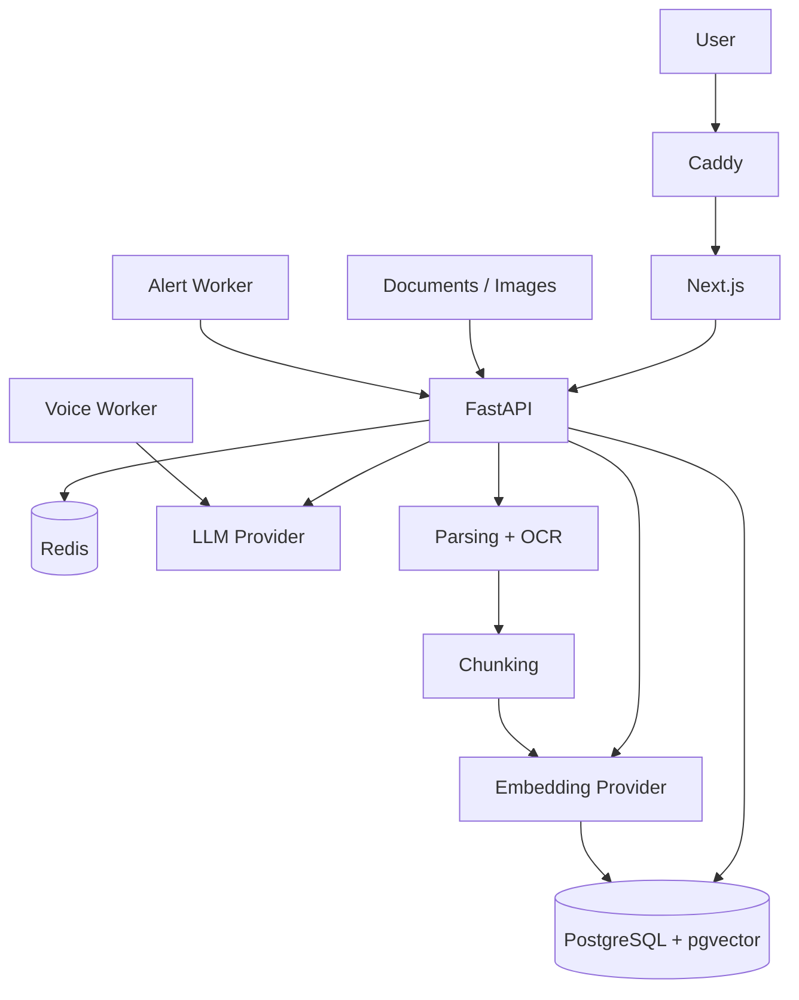
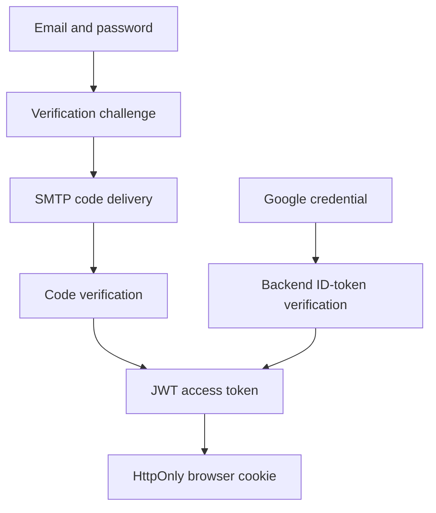
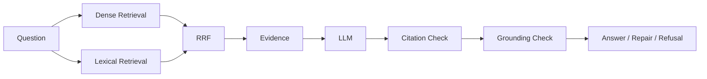
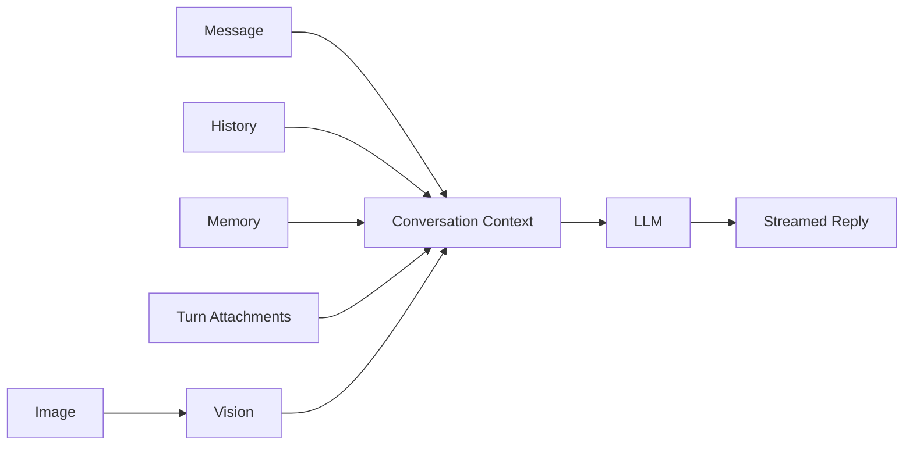

# Architecture

## Overview

Aqlyra is split into a web frontend, an API backend, persistent storage, retrieval components, model providers, and a small set of operational workers.

The two main user flows are different by design:

- **Converse** handles general chat.
- **Knowledge** handles document-grounded questions.

Keeping them separate makes it easier to apply strict evidence rules only where they are needed.

## Runtime layout



The Docker setup contains:

```text
postgres
redis
backend
frontend
voice-worker
alert-worker
caddy
```

## Backend layout

The backend is split by responsibility instead of putting most logic inside route handlers.

| Area | Responsibility |
|---|---|
| `api/` | HTTP routes |
| `services/` | application workflows |
| `parsers/` | file parsing |
| `chunking/` | document chunking |
| `embeddings/` | embedding providers |
| `retrieval/` | dense/lexical retrieval and fusion |
| `rag/` | context building, citations, grounding |
| `llms/` | model provider adapters |
| `voice/` | voice worker |
| `core/` | logging, metrics, rate limiting |
| `alerting/` | alert evaluation and delivery |
| `database/` | engine and database sessions |
| `models/` | persistent models |

## Identity and session flow

Both supported identity paths converge on the same Aqlyra session model.



For email registration, the backend creates a user that cannot log in until
the verification challenge succeeds. The six-digit code is stored as an HMAC
digest, expires after a bounded interval, has a failed-attempt limit, and is
subject to resend and endpoint rate limits. A short-lived, typed verification
ticket binds the browser flow to the user and challenge without exposing the
challenge in client-readable storage.

For Google sign-in, the browser receives a Google Identity Services
credential. The backend validates the configured audience, accepted issuer,
stable Google subject, email address, and verified-email claim before linking
or creating the local user. The Google Client Secret is not used by this
ID-token flow.

The Next.js authentication routes exchange either successful result for the
same backend access token, confirm the user through `/users/me`, and place the
token in an HttpOnly, SameSite cookie.

## Knowledge request flow



The stages are kept separate on purpose.

If an answer is wrong, the system can be inspected at the point where the problem happened:

```text
retrieval
evidence selection
generation
citation validation
grounding
provider failure
```

## Converse flow



Converse can use normal model knowledge. Knowledge cannot silently fall back to unsupported model knowledge when document evidence is required.

## Data storage

PostgreSQL stores the main application state:

- users;
- linked Google subjects and email-verification state;
- email verification challenges;
- documents;
- chunks;
- embeddings;
- conversations;
- messages;
- projects and conversation-to-project assignments;
- Knowledge document scopes;
- memory.

`pgvector` stores vectors in the same database.

That keeps ownership data and retrieval filters close together.

Redis is used for rate-limit counters.

Uploaded files are stored separately from the database in persistent storage.

Projects organize conversations inside either Converse or Knowledge mode. A
project and its conversations must belong to the same authenticated user and
use the same mode. Deleting a project preserves its conversations and returns
them to the regular history list. Creating a project also creates and opens an
initial chat; the first user turn replaces its placeholder title with a title
derived from that turn.

## Security boundaries

The authenticated user identity is the source of truth for access control.

Password users must complete email verification before login. Google users are
accepted only from verified Google ID-token claims. Access tokens and email
verification tickets have distinct token types, and the browser keeps both in
HttpOnly cookies.

The backend checks ownership before returning documents, conversations, messages, memory, or document content.

Rate-limited routes use Redis-backed counters.

When Redis is required for the protected operation and is unavailable, the backend fails closed instead of allowing the request through without rate limiting.

## Logs, metrics, and readiness

The backend provides:

```text
/api/v1/health
/api/v1/readiness
/api/v1/metrics
```

Production logs are structured JSON and include request IDs and timing information.

Metrics use route templates instead of raw dynamic IDs to avoid unbounded labels.

## Alert worker

The alert worker reads readiness and metrics and checks for:

- service failures;
- metrics failures;
- 5xx spikes;
- high p95 latency;
- unhandled exceptions;
- Redis/rate-limit backend failures;
- unusual rate-limit rejection volume.

It keeps alert state so the same incident is not sent repeatedly, and it emits a resolved event when the condition clears.

## Backup and restore

Scripts under `scripts/ops/` handle database and upload backups.

Backup verification restores into temporary state before the backup is treated as valid.

Restore is explicit and does not overwrite live data silently.
