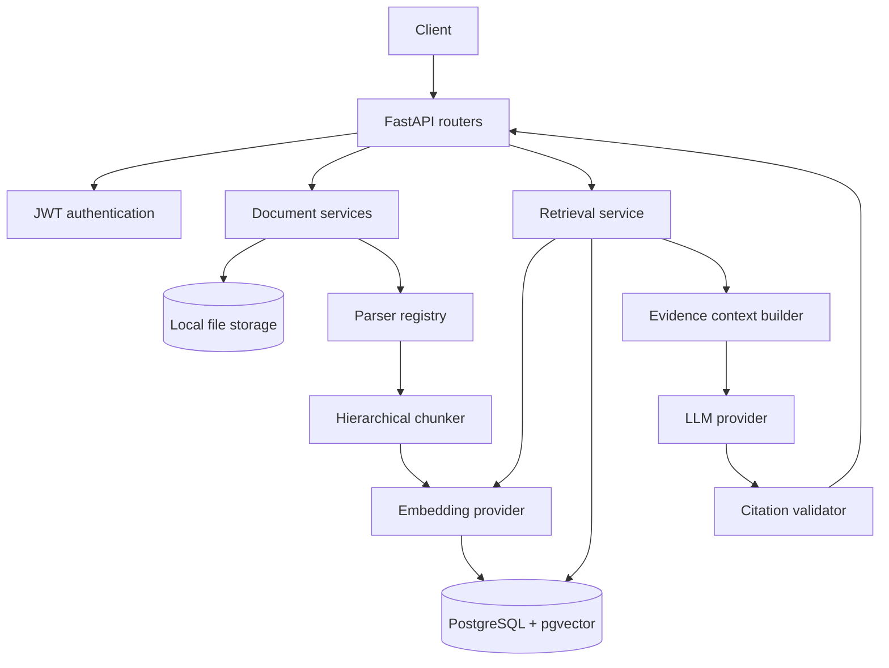
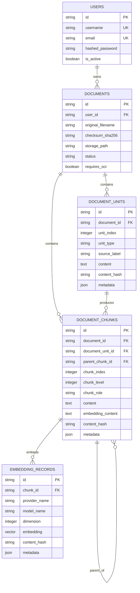
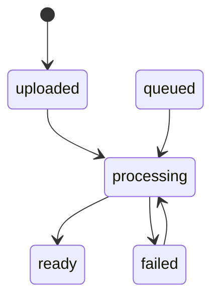

# Architecture

This file records how the backend is currently put together and why a few choices were made. It describes the code that exists now; future ideas are kept in the final section.

## System boundary

Ihsan RAG AI is currently a backend service. A client can register, upload private documents, process them, search them, and request a grounded answer. The backend owns authentication, storage coordination, parsing, chunking, embeddings, retrieval, and answer validation.

There is no frontend or background worker in the repository yet.



## Code boundaries

### API layer

FastAPI routers handle HTTP concerns:

- request and response schemas;
- authentication dependencies;
- conversion of domain errors to HTTP status codes;
- route grouping under `/api/v1`;
- OpenAPI documentation.

The API layer delegates the actual work to services. Parsing, vector queries, and provider calls are not implemented directly inside route functions.

Current route groups include authentication, users, documents, embedding rebuilds, retrieval, and RAG answers.

### Service layer

Services coordinate use cases that touch more than one component:

- user creation and authentication;
- file and document record management;
- document processing;
- embedding persistence and rebuilds;
- vector retrieval;
- complete RAG answer orchestration.

The RAG answer service is intentionally an orchestration layer. It calls retrieval, context construction, generation, and citation validation rather than combining those rules in one large function.

### Processing modules

The processing modules contain the parts that can be tested without HTTP:

- parser contracts and format-specific parsers;
- text normalization;
- chunk construction;
- embedding provider interfaces;
- retrieval query and hit types;
- context building;
- LLM provider interfaces;
- grounded prompt construction;
- citation validation.

Deterministic providers are used to test these boundaries without network access.

### Persistence layer

SQLAlchemy models map the application data to PostgreSQL. Alembic owns schema changes. pgvector adds the vector column and nearest-neighbor index.

The main tables are:

```text
users
  └── documents
        ├── document_units
        │     └── document_chunks
        └── document_chunks
              └── embedding_records
```

`document_chunks` also has a self-reference for parent and child chunks.

## Data model



Important invariants include:

- duplicate document content is blocked per user by checksum;
- unit and chunk ordering is stored explicitly;
- one chunk cannot have two records for the same provider and model;
- the current vector column has a fixed dimension of 384;
- document ownership is enforced through the document record, not through client-supplied user IDs.

## Document lifecycle



`queued` exists in the state model for a future worker, but current processing runs synchronously.

A document in `ready` state is not processed again through the normal processing endpoint. Embeddings have a separate rebuild path because re-embedding should not recreate units and chunks.

## Main workflows

### Upload

1. The route requires an authenticated user.
2. The file is streamed to temporary storage while size, extension, content, and checksum are checked.
3. Existing content for the same user is detected before insert.
4. A database constraint is the final protection against concurrent duplicate uploads.
5. The file is finalized and a document record is created with `uploaded` status.

The application tries to keep the filesystem and database in a consistent state when one side fails.

### Processing

1. Ownership and status are checked.
2. The parser registry chooses a parser from the file extension.
3. The parser returns ordered source units.
4. Units are normalized and persisted.
5. The chunker creates content chunks and, when useful, parent summary chunks.
6. The configured embedding provider creates vectors.
7. Chunks and embedding records are persisted.
8. The document moves to `ready`; failures move it to `failed`.

### Retrieval

1. The authenticated user's ID is inserted into `RetrievalQuery` by the server.
2. The query is embedded with the configured embedding provider.
3. PostgreSQL performs cosine search on records for the same provider and model.
4. The SQL query joins through the document and filters by owner and ready status.
5. Optional document IDs, chunk roles, and minimum similarity further narrow the result.
6. Ranked hits return content plus filename, section, page, hierarchy, and score metadata.

A document ID from another account returns no evidence because it is applied inside the existing owner scope.

### Grounded answer

1. Retrieval returns tenant-safe hits.
2. The context builder removes empty and duplicate evidence.
3. A selected child chunk can suppress a redundant parent summary.
4. Global and per-source budgets limit the prompt size.
5. Sources receive stable IDs such as `S1` and `S2`.
6. The LLM receives the question and only the selected evidence.
7. The citation validator rejects missing, malformed, unknown, or uncited references.
8. The API returns the answer and only the sources actually cited.

When retrieval produces no usable evidence, the service returns a refusal without calling the LLM.

## Security model

### Authentication

Passwords are hashed with bcrypt. Login returns a JWT access token. Protected routes resolve the current user from that token and reject inactive or missing users.

### Tenant isolation

The central rule is simple: private rows are always reached through the authenticated user's documents.

Client input can provide `document_ids`, but those IDs are only filters inside the user's existing scope. They are not treated as proof of access.

This rule is covered in both retrieval and end-to-end RAG API tests.

### Untrusted document content

The grounded prompt tells the model to treat retrieved text as reference data and not as instructions. This is a useful control against simple prompt injection inside uploaded files, but it is not a complete prompt-injection defense.

### Secrets

API keys and the JWT secret belong in `backend/.env`. Only `.env.example` is tracked.

## Provider boundaries

### Embeddings

The embedding interface currently has two implementations:

- a deterministic SHA-256-based provider for tests;
- an OpenAI provider for real semantic embeddings.

Provider name, model name, content hash, vector dimension, and optional usage metadata are stored with each embedding record.

### LLMs

The LLM interface currently has:

- a deterministic provider for tests and local pipeline checks;
- an OpenAI provider using the Responses API.

The OpenAI request disables response storage for document-based generation. The application normalizes provider output into its own result type before the RAG layer uses it.

## Transaction and failure boundaries

The project separates errors that the client can fix from provider and server failures.

Examples:

- invalid request or retrieval configuration: `422`;
- duplicate upload or invalid processing state: `409`;
- unavailable embedding or LLM provider: `503`;
- generated answer that fails grounding or citation checks: `502`.

The embedding rebuild operation replaces only records for the selected provider/model and rolls back if generation or persistence fails. Existing records from other providers are left untouched.

## Why PostgreSQL and pgvector

A dedicated vector database would add another service, another authorization boundary, and a synchronization problem between relational metadata and vectors.

For this project, PostgreSQL keeps the first version easier to reason about:

- owner filtering and vector search happen in one query path;
- document deletion can cascade to chunks and embeddings;
- embedding rebuilds can use normal transactions;
- local development only needs one database container.

This choice can be revisited after measuring a real scale or latency problem. It is not meant to claim that pgvector is always the correct store for every workload.

## Testing

The latest local suite has 86 passing tests. Coverage is organized around behavior rather than only individual functions:

- auth and ownership;
- upload and duplicate races;
- parser and chunk persistence;
- embedding configuration and rebuilds;
- exact and filtered vector retrieval;
- cross-user isolation;
- context limits and source ordering;
- provider error normalization;
- prompt construction and refusal handling;
- citation validation;
- complete RAG answer API responses.

There is no GitHub Actions workflow yet. The current result is from local pytest runs.

## Known gaps

The architecture is useful for a portfolio backend, but it is not a finished hosted product.

- Processing is synchronous.
- Files are stored on the local filesystem.
- OCR execution is missing.
- Hybrid retrieval and reranking are missing.
- Citation checks are structural, not claim-level entailment checks.
- No evaluation dataset or retrieval metrics are tracked yet.
- There is no rate limiting, observability stack, object storage, background queue, or deployment setup.
- Conversation memory, streaming, voice, and a web interface are outside the current implementation.

The next useful work is stabilization and evaluation before adding more providers or UI features.
